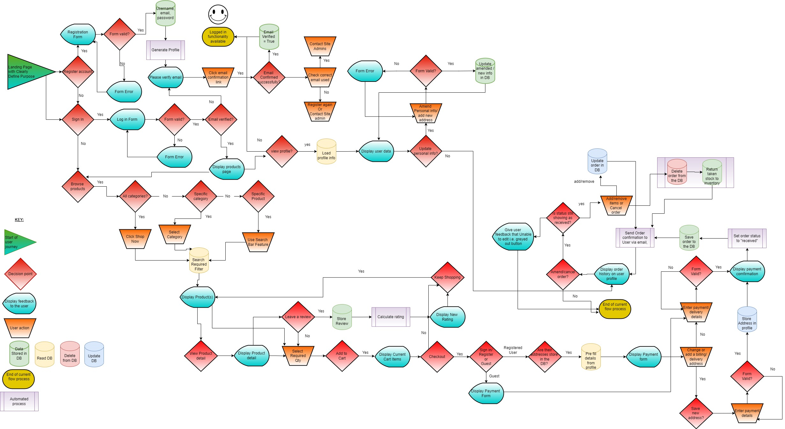

# **Vapor Deli** (review after project and add where needed)

Vapor deli is a fictional B2C vape supply store design and implemented with Django, Python, HTML and CSS. IIt aims to provide and easy to use interface where customers can browse all items at once or sort into specified categories. The site provides search functionality as well as an inbuilt stock system to ensure users cannot buy items which are not currently in stock, and once signed in allows the user to save an address to their profile for easy and convenient checkout.

**RESPONSIVE SCREENSHOT TO GO HERE**

**TOC HERE**

## **Planning Phase**

## **Strategy**

### ***Site Aims***

These days vaping has become a very popular and wide spread replacement for traditional cigarettes and therefore the possible product categories are vast. For some is has proved a way to stop smoking, for others it has become a hobby/lifestyle, and in some places it has even become a sport with organized cloud chasing competitions to judge who can make the biggest vapor clouds. The aim of this site is to act as the online presence for a fictional vape supply store, and to provide a simple and easy to use interface for customers to browse and purchase products.

For the purpose of this project I will only be focusing on the few categories which are widely considered to be the core products in the vaping scene,  and any customer would expect to find in a store of this type. The exception to this would be sites that specialize in solely the production of e-liquid (e.g. [flavor art](https://flavourart.com/)) or vaping devices (e.g [SmokStore](https://www.smokstore.com/)). Since this site is designed to be the web presence of a physical shop, a variety of products is expected to assist people with their vaping needs.

The minimum must have product categories for a shops in the genre are: -

* Disposable vapes.
* E-liquids.
* DIY liquids section.
* MODS with Variable wattage/voltage, and/or temperature control.
* Tanks and coils.
* Batteries.
* Chargers.

### ***Opportunities:***

To provide a fully functioning E-commerce platform the following opportunities are available: -

Opportunity | Importance | Viability/Feasibility
---|---|---
Age verification on first visit | 5 | 3
Mailing list | 5 | 5
Account profile | 5 | 5
Product Filters/searching | 5 | 5
SEO language throughout | 5 | 5
stripe payments | 5 | 5
User feedback for actions taken | 5 | 5
Check out system | 5 | 5
Guest checkout completion | 5 | 5
User log in/register | 5 | 5 |
Vape Blog | 1 | 5
Video demo of products | 1 | 5
Delivery information | 3 | 5
User Role permissions | 5 | 5
Product reviews | 5 | 3
Full CRUD functionality | 5 | 5
Order History | 5 | 5
Stock management system | 5 | 3 |
Contact form | 3 | 5
Social Media pages | 5 | 5
Special offers | 5 | 5
Password Recovery | 5 | 5
Email confirmation of order | 5 | 5
Linking online stock to Point of sale system in the shop | 5 | 1
Related products | 1 | 1
Saved customer details on checkout | 5 | 5
Admin can add/remove products via the front end | 3 | 5
Multiple currencies | 5 | 1
Trustpilot reviews | 5 | 1
Terms and conditions | 3 | 5
Generate sales reports | 5 | 1
Order Status | 2 | 5
Ability to edit order until status set to processing | 1 | 5
---------------------- | --- | ---  
Totals | 138 | 139

### ***Scope:***

Due to the time given for this project and the required grade criteria There will definitely need to be some trade offs in design/development process. Using the agile methodology I will be reviewing my progress weekly and adding, adapting or removing features as applicable to the project at the review portion after each sprint in order to ensure a MVP is delivered by the deadline.

To avoid scope creep I have used the MoSCoW method to divided the above opportunities into the below categories aiding me prioritize and ensure that I can achieve my goal of a fully functioning MVP by the deadline: -

* In order to create a minimum functional E-commerce site, UX efforts **must** address these opportunities: -
  * Full CRUD Functionality.
  * User log in/register.
  * Checkout system.
  * Account profile.
  * Mailing list.
  * Product Filters/searching.
  * Stripe payments.
  * SEO language throughout.
  * Guest checkout completion.
  * User Role permissions.
  * Order History.
  * Social Media pages.
  * Special offers.
  * Password Recovery.
  * Email confirmation of order.
  * User feedback for actions taken.
  * Saved customer details on checkout.

* In order to enhance the customer experience and increase the sites functionality, UX efforts **should** address these opportunities: -
  * Age verification on first visit.
  * Product reviews.
  * Stock management system.
  * Contact form.
  * Admin can add/remove products via the front end.
  * Delivery information.
  * Terms and conditions.
  * Order Status.

* In order to increase the sites popularity and customer base, UX efforts **could** address these opportunities: -
  * Vape Blog.
  * Video demo of products.
  * Related products
  * Ability to edit order until status set to processing.

* As they are so far out of the scope of this project, UX efforts **will not** address these opportunities: -
  * Linking online stock to Point of sale system in the shop.
  * Trustpilot reviews.
  * Multiple currencies.
  * Generate sales reports.

### ***Structure:***

Using the the above as a guide I have created a flow diagram to help me visualize how the user will navigate through the core functionality of the web store. During the Agile process there may be some minor tweaks to this pre planned user journey but the overall structure will remain the same. **TO ADD MAILING LIST TO FLOW CHART and give each path a final check**

#### **User Stories:**

To assist the AGILE process I have created a number of user stories to help me plan and implement the project. These will help me prioritize the features and functionality of the site and ensure that I am delivering a MVP by the deadline. The below user stories are divided to EPICs and will be reviewed and updated after each sprint.

##### **EPIC 1 - Set up and Deployment:**

This Epics will be tasks rather than user stories since they will be aimed at me as the developer rather than the user. The below tasks will be completed before the first sprint and will be used to set up the project and ensure that it is deployed to Heroku with the AWS S3 bucket for static files. Some of these were taken/adapted from the Code Institute's sample project Boutique ado.

* As a **Developer** I can...
  * ...**Create a Git hub repository** so that I can **Store my project files online.**
  * ...**Create a virtual environment on my local machine** so that I can **avoid polluting my machine on a global level.**
  * ...**Install Django and required libraries** so that I can **work with a postgress Database and cloudbased images from my local development IDE.**
  * ...**Set up my local coding environment** so that I can **develop on my local machine and deploy securely without revealing sensitive information.**
  * ...**Create a Heroku app** so that I can **link to the a virtually hosted Postgres database for the deployed site.**
  * ...**Create a new AWS S3 bucket** so that I can **store static files and images securely.**

The only user story in this Epic is related to the initial deployment, this is a user story rather than a task because it directly offers value to the user as opposed to being tasks required to create the project: -

* As a **User**, I can **access a live url** so that I can **use the site on any device**.

##### **EPIC 2 - Viewing and Navigation:**

* As a **Shopper** I want to be able to...
  * ...**Clearly identity the sites purpose upon visiting** so that I can **determine if the site is what I am looking for.**
  * ...**View a list of products** so that I can **select some to purchase.**
  * ...**View individual product details** so that I can **identify the price, description, detailed reviews, and product image enabling me to compare how the product differs from other items.**
  * ...**View the total of my purchases at any time** so that I can **see and review how much I am spending at any time whilst building an order.**
  * ...**Leave a review** so that I can **share my opinion of a product and leave a star rating.**
  * ...**View reviews of a product** so that I can **see what other people think of a product.**
  * ...**Identify any promotions that are available** so that I can **take advantage of them and obtain the best value for money possible.**

##### **EPIC 3 - Registration and User Accounts:**

* As a **Site User** I want to be able to...
  * ...**Register for an account** so that I can **save my personal details, view my order history online.**
  * ...**Easily login or logout at any time** so that I can **access my personal account information and protect it from unauthorized viewing on shared devices.**
  * ...**Add multiple addresses to my account** so that I can **order to different locations.**
  * ...**Save my personal details to my profile from the checkout page** so that I **don’t have to enter them every time I make a purchase.**
  * ...**Amend my personal details from my profile** so that I can **update information should there be any changes.**
  * ...**Recover my password in case I forget it** so that I can **regain access to my account in the event I lose my password.**
  * ...**Receive an email confirmation upon registration** so that I can **confirm the registration process worked correctly.**

##### **EPIC 4 - Sorting and Searching:**

* As a **Shopper** I want to be able to...
  * ...**Sort the list of available products** so that I can **view them in different orders. and find the highest/lowest rating/prices and sort alphabetically to aid in finding the most suitable products to suit my needs.**
  * ...**Search for a product by name or content in the product description** so that I can **find a specific product I am looking for.**
  * ...**View a list of products in a specific category** so that I can **view all products in that category.**
  * ...**Identify what I have searched for easily and the number of results found** so that I can **easily see the availability of the item I searched for and quickly find the product I want.**
  <!-- * ...**Sort a specific category of products** so that I can **search for a specific type of product according to my needs.** -->

##### **EPIC 5 - Purchasing and Checkout:**

* As a **Shopper** I want to be able to...
  * ...**Select a quantity of a product** so that I can **buy the required amount of the product.**
  * ...**View items in my bag to be purchased** so that I can **identify the total cost of my purchases before checkout.**
  * ...**Adjust the quantity of individual items in my bag** so that I can **easily make changes to my bag.**
  * ...**Easily enter my payment information** so that I can **checkout quickly with no hassles by using information previously stored in the system.**
  * ...**View an order confirmation after checkout** so that I can **verify that I haven’t made any mistakes.**
  * ...**Receive an email confirmation after checking out** so that I can **keep a record of my order.**
  * ...**View my order history** so that I can **see the orders I have made previously.**
  * ...**Access the checkout page** so that I can **review my order whilst entering my payment/shipping details**
  * ...**securely submit my payment details** so that I can **rest assured my financial information is safe**

##### **EPIC 6 - Admin and Store Management:**

* As a **Store Owner** I want to be able to...
  * ...**Add a product** so that I can **add new products to the store.**
  * ...**Edit/update a product** so that I can **change product details.**
  * ...**Delete a product** so that I can **remove products that are no longer for sale.**
  * ...**Add a category** so that I can **add new categories to the store.**
  * ...**Edit/update a category** so that I can **change category details.**
  * ...**Delete a category** so that I can **remove categories that are no longer for sale.**
  * ...**Add a promotion** so that I can **add new promotions to the store.**
  * ...**manually manage the stock levels** so that I can **input received purchase orders and ensure that the stock levels are accurate in case of discrepancies or damages.**

### **Skeleton:**

#### **Wireframes:**

#### **Database Schema**: