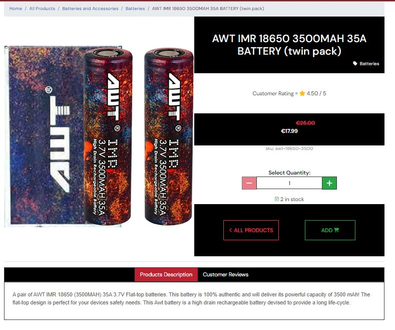
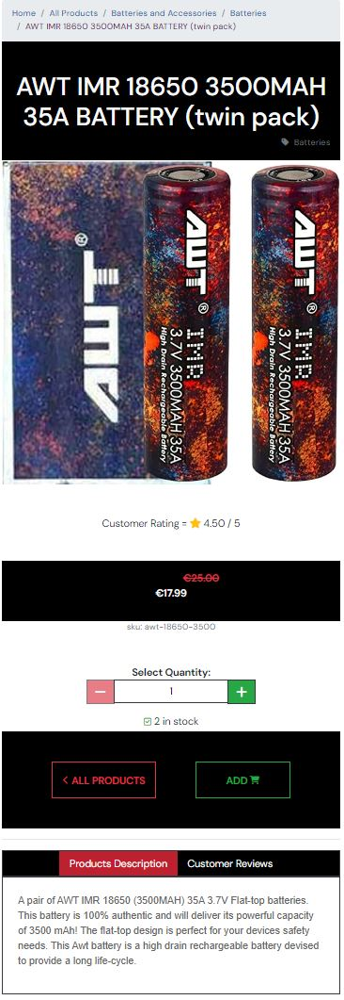

# **Vapor Town** (review after project and add where needed)

Vapor Town is a fictional B2C vape supply store designed and implemented with Django, Python, HTML and CSS. IIt aims to provide and easy to use interface where customers can browse all items at once or sort into specified categories. The site provides search functionality as well as an inbuilt stock system to ensure users cannot buy items which are not currently in stock, and once signed in allows the user to save an address to their profile for easy and convenient checkout.

This small scale business idea was born from a pipe dream back in the day where I use to dream of having an online store selling all the latest and greatest vape gear. I have since moved on from that dream and decided to use this project as a way to learn and practice my skills in Django and Python.

**RESPONSIVE SCREENSHOT TO GO HERE**

**TOC HERE**

# **Planning Phase**

## **Strategy**

### ***Site Aims***

These days vaping has become a very popular and wide spread replacement for traditional cigarettes and therefore the possible product categories are vast. For some is has proved a way to stop smoking, for others it has become a hobby/lifestyle, and in some places it has even become a sport with organized cloud chasing competitions to judge who can make the biggest vapor clouds.

The aim of this site is to act as the online presence for a fictional vape supply store, and to provide a simple and easy to use interface for customers to browse and purchase products.

For the purpose of this project I will only be focusing on the few categories which are widely considered to be the core products in the vaping scene,  and any customer would expect to find in a store of this type. The exception to this would be sites that specialize in solely the production of e-liquid (e.g. [flavor art](https://flavourart.com/)) or vaping devices (e.g [SmokStore](https://www.smokstore.com/)). Since this site is designed to be the web presence of a physical shop, a variety of products is expected to assist people with their vaping needs and the admin panel will be leveraged with a user manual for the shop staff who will be managing the site sales during quieter periods in the shop.

The minimum must have product categories for a shops in the genre are: -

* Disposable vapes.
* E-liquids.
* DIY liquids section.
* MODS with Variable wattage/voltage, and/or temperature control.
* Tanks and coils.
* Batteries.
* Chargers.

### ***Opportunities***

To provide a fully functioning E-commerce platform the following opportunities are available: -

Opportunity | Importance | Viability/Feasibility
---|---|---
Age verification on first visit | 5 | 3
Mailing list | 5 | 5
Account profile | 5 | 5
Product Filters/searching | 5 | 5
SEO language throughout | 5 | 5
stripe payments | 5 | 5
User feedback for actions taken | 5 | 5
Check out system | 5 | 5
Guest checkout completion | 5 | 5
User log in/register | 5 | 5 |
Vape Blog | 1 | 5
Video demo of products | 1 | 5
Delivery information | 3 | 5
User Role permissions | 5 | 5
Product reviews | 5 | 3
Full CRUD functionality | 5 | 5
Order History | 5 | 5
Stock management system | 5 | 3 |
Contact form | 3 | 5
Social Media pages | 5 | 5
Special offers | 5 | 5
Password Recovery | 5 | 5
Email confirmation of order | 5 | 5
Linking online stock to Point of sale system in the shop | 5 | 1
Related products | 1 | 1
Saved customer details on checkout | 5 | 5
Admin can add/remove products via the front end | 3 | 5
Multiple currencies | 5 | 1
Trustpilot reviews | 5 | 1
Terms and conditions | 3 | 5
Generate sales reports | 5 | 1
Order Status | 2 | 5
Ability to edit order until status set to processing | 1 | 5
---------------------- | --- | ---  
Totals | 138 | 139

### ***Scope***

Due to the time given for this project and the required grade criteria There will definitely need to be some further trade offs in design/development process. Using the agile methodology I will be reviewing my progress weekly and adding, adapting or removing features as applicable to the project at the review portion after each sprint in order to ensure a MVP is delivered by the deadline.

To avoid scope creep I have used the MoSCoW method to divided the above opportunities into the below categories aiding me prioritize and ensure that I can achieve my goal of a fully functioning MVP by the deadline: -

* In order to create a minimum functional E-commerce site, UX efforts **must** address these opportunities: -
  * Full CRUD Functionality.
  * User log in/register.
  * Checkout system.
  * Account profile.
  * Mailing list.
  * Product Filters/searching.
  * Stripe payments.
  * SEO language throughout.
  * Guest checkout completion.
  * User Role permissions.
  * Order History.
  * Social Media page.
  * Special offers.
  * Password Recovery.
  * Email confirmation of order.
  * User feedback for actions taken.
  * Saved customer details on checkout.

* In order to enhance the customer experience and increase the sites functionality, UX efforts **should** address these opportunities: -
  * Age verification on first visit.
  * Product reviews.
  * Stock management system.
  * Contact form.
  * Admin can add/remove products via the front end.
  * Delivery information.
  * Terms and conditions.
  * Order Status.

* In order to increase the sites popularity and customer base, UX efforts **could** address these opportunities: -
  * Vape Blog.
  * Video demo of products.
  * Related products
  * Ability to edit order until status set to processing.

* As they are so far out of the scope of this project, UX efforts **will not** address these opportunities: -
  * Linking online stock to Point of sale system in the shop.
  * Trustpilot reviews.
  * Multiple currencies.
  * Generate sales reports.

### ***Structure***

Using the the above as a guide I have created a flow diagram to help me visualize how the user will navigate through the core functionality of the web store. During the Agile process there may be some minor tweaks to this pre planned user journey but the overall structure will remain the same. **TO ADD MAILING LIST TO FLOW CHART and give each path a final check**

#### **User Stories:**

To assist the AGILE process I have created a number of user stories to help me plan and implement the project. These will help me prioritize the features and functionality of the site and ensure that I am delivering a MVP by the deadline. The below user stories are divided to EPICs and will be reviewed and updated after each sprint.

##### **EPIC 1 - Set up and Deployment:**

This Epics will be tasks rather than user stories since they will be aimed at me as the developer rather than the user. The below tasks will be completed before the first sprint and will be used to set up the project and ensure that it is deployed to Heroku with the AWS S3 bucket for static files. Some of these were taken/adapted from the Code Institute's sample project Boutique ado.

* As a **Developer** I can...
  * ...**Create a Git hub repository** so that I can **Store my project files online.**
  * ...**Create a virtual environment on my local machine** so that I can **avoid polluting my machine on a global level.**
  * ...**Install Django and required libraries** so that I can **work with a postgress Database and cloudbased images from my local development IDE.**
  * ...**Set up my local coding environment** so that I can **develop on my local machine and deploy securely without revealing sensitive information.**
  * ...**Create a Heroku app** so that I can **link to the a virtually hosted Postgres database for the deployed site.**
  * ...**Create a new AWS S3 bucket** so that I can **store static files and images securely.**

The only user story in this Epic is related to the initial deployment, this is a user story rather than a task because it directly offers value to the user as opposed to being tasks required to create the project: -

* As a **User**, I can **access a live url** so that I can **use the site on any device**.

##### **EPIC 2 - Viewing and Navigation:**

* As a **Shopper** I want to be able to...
  * ...**Clearly identity the sites purpose upon visiting** so that I can **determine if the site is what I am looking for.**
  * ...**View a list of products** so that I can **select some to purchase.**
  * ...**View individual product details** so that I can **identify the price, description, detailed reviews, and product image enabling me to compare how the product differs from other items.**
  * ...**View the total of my purchases at any time** so that I can **see and review how much I am spending at any time whilst building an order.**
  * ...**Leave a review** so that I can **share my opinion of a product and leave a star rating.**
  * ...**View reviews of a product** so that I can **see what other people think of a product.**
  * ...**Identify any promotions that are available** so that I can **take advantage of them and obtain the best value for money possible.**
  * ...**See clearly when something goes wrong on the site** so that I can **correct any errors and continue with my purchase.**
  * ... **See a pleasantly styled and easy to navigate site** so that I can **enjoy the experience of using the site.**
  * ...**Easily contact the store owner** so that I can **ask questions about the products or the site.**
  * As a **business owner** I want to be able to...
    * ...**All site users are of legal age to purchase vape supplies** so that I can **comply with the law.**  

##### **EPIC 3 - Registration and User Accounts:**

* As a **Site User** I want to be able to...
  * ...**Register for an account** so that I can **save my personal details, view my order history online.**
  * ...**Easily login or logout at any time** so that I can **access my personal account information and protect it from unauthorized viewing on shared devices.**
  * ...**Save my personal details to my profile from the checkout page** so that I **don’t have to enter them every time I make a purchase.**
  * ...**Amend my personal details from my profile** so that I can **update information should there be any changes.**
  * ...**Recover my password in case I forget it** so that I can **regain access to my account in the event I lose my password.**
  * ...**Receive an email confirmation upon registration** so that I can **confirm the registration process worked correctly.**

##### **EPIC 4 - Sorting and Searching:**

* As a **Shopper** I want to be able to...
  * ...**Sort the list of available products** so that I can **view them in different orders. and find the highest/lowest rating/prices and sort alphabetically to aid in finding the most suitable products to suit my needs.**
  * ...**Search for a product by name or content in the product description** so that I can **find a specific product I am looking for.**
  * ...**View a list of products in a specific category** so that I can **view all products in that category.**
  * ...**Identify what I have searched for easily and the number of results found** so that I can **easily see the availability of the item I searched for and quickly find the product I want.**

##### **EPIC 5 - Purchasing and Checkout:**

* As a **Shopper** I want to be able to...
  * ...**Select a quantity of a product** so that I can **buy the required amount of the product.**
  * ...**View items in my bag to be purchased** so that I can **identify the total cost of my purchases before checkout.**
  * ...**Adjust the quantity of individual items in my bag** so that I can **easily make changes to my bag.**
  * ...**Easily enter my payment information** so that I can **checkout quickly with no hassles by using information previously stored in the system.**
  * ...**View an order confirmation after checkout** so that I can **verify that I haven’t made any mistakes.**
  * ...**Receive an email confirmation after checking out** so that I can **keep a record of my order.**
  * ...**View my order history** so that I can **see the orders I have made previously.**
  * ...**Access the checkout page** so that I can **review my order whilst entering my payment/shipping details**
  * ...**securely submit my payment details** so that I can **rest assured my financial information is safe**

##### **EPIC 6 - Admin and Store Management:**

* As a **Store Owner** I want to be able to...
  * ...**Add a product** so that I can **add new products to the store.**
  * ...**Edit/update a product** so that I can **change product details.**
  * ...**Delete a product** so that I can **remove products that are no longer for sale.**
  * ...**Add a promotion** so that I can **add new promotions to the store.**
  * ...**manually manage the stock levels** so that I can **input received purchase orders and ensure that the stock levels are accurate in case of discrepancies or damages.**

##### **EPIC 7 - Product Reviews:**

* As a **Shopper** I want to be able to...
  * ...**Leave a review** so that I can **share my opinion of a product and leave a rating.**
  * ...**View reviews of a product** so that I can **see what other people think of a product.**
  * ...**Edit my reviews of a product** so that I can **update my public opinion should it ever change**
  * ...**delete my reviews of a product** so that I can **remove previous reviews should I see fit**.

##### **EPIC 8 - Marketing:**

* As a **business owner** I want to be able to...
  * ...**Send promotional emails** so that I can **promote new products and offers to my customers.**
  * ...**Set up a social media page** so that I can **promote my business and products to the global market.**
  * ...**Increase my search engine ranking** so that I can **increase the number of visitors to my site.**

#### User Stories dropped as part of the AGILE process

##### **Form Epic 3 - Registration and User Accounts:**

* As a **Site User** I want to be able to **Add multiple addresses to my account** so that I can **order to different locations.**

##### **Form Epic 6 - Admin and Store Management:**

* As a **Store Owner** I want to be able to...
  * ...**Edit/update a category** so that I can **change category details.**
  * ...**Delete a category** so that I can **remove categories that are no longer for sale.**
  * ...**Add a category** so that I can **add new categories to the store.**
  
### **Skeleton**

#### **Wireframes:**

Wireframes were created using Balsamiq wireframes to get a visual idea of how the site would look and function. I have included these below however there where some changes/omissions made during the development process due to time or practicality.

##### ***Home Page:***

[Home page wireframe](docs/wireframes/landing-page.png)

##### ***Products Page:***

[Products page wireframe](docs/wireframes/products-page.png)

##### ***Product Details Page:***

This page changed from the original design in the following ways:

* Multiple images not implemented and so no accordion was needed.
* Buy now button was removed as it was not needed.

These will now be added as part of the future features.

[Product details page wireframe](docs/wireframes/product-detail-page.png)

##### ***Shopping Cart Page:***

[Shopping cart page wireframe](docs/wireframes/shopping-cart-page.png)

##### ***Checkout Page:***

[Checkout page wireframe](docs/wireframes/checkout-page.png)

##### ***User Profile Page:***

This page changed from the original design in the following ways:

* No multiple addresses.
* No delete account button.
* No image/avatar upload.

These will now be added as part of the future features.

[User profile page wireframe](docs/wireframes/user-profile.png)

##### ***Order Confirmation Page:***

[Order confirmation page wireframe](docs/wireframes/order-confirmation-page.png)

#### **Database Schema:**

The database table scheme was created using [drawsql.app](drawsql.app) and can be seen below.

##### ***All Products Table***

This table was designed for scalability, I didn't have time to leverage the full advantages of a polymorphic data set but I have included the fields that would be needed to do so. In the future I would be automating a lot more processes allowing for products with sizes to be linked together and display the product options on a single product page. This kind of database model also allows for quicker queries as the volume of products grow so it was put in now to save a lot of restructuring late on when the business popularity grows.

[All products table](docs/flowcharts/database/products.png)

[View online with notes](https://drawsql.app/teams/student-444/diagrams/pp5-vapor-town/embed)

##### ***Product Reviews Table***

[Product reviews table](docs/flowcharts/database/product-reviews.png)

[View online with notes](https://drawsql.app/teams/student-444/diagrams/reviews/embed)

##### ***Contact us Table***

[Contact us table](docs/flowcharts/database/contact-us.png)

[View online with notes](https://drawsql.app/teams/student-444/diagrams/reviews/embed)

##### ***Order Tables***

[Order tables](docs/flowcharts/database/checkout.png)

[View online with notes](https://drawsql.app/teams/student-444/diagrams/checkout-app/embed)

##### ***Profile Table***

[Profile table](docs/flowcharts/database/profiles.png)

[View online with notes](https://drawsql.app/teams/student-444/diagrams/profiles/embed)

##### ***Full ERD from PgAdmin***

This was taken via pgAdmin connected directly to my instance of elephant SQL and shows the complete relationship of all tables inclusive of any which came from libraries such as all auth.

[Full ERD](docs/flowcharts/database/pgadmin-erd.png)

### **SEO considerations**

#### ***Keywords***

Unfortunately the site word tracker was never working enough for me to use. I even subscribed and continued to encounter the issue where I had no results or was told i had made to many searched. Speaking to their customer support they advise this is a known issue and they are working on it, but its been a few months and its still not working for me. That said I have included a brain dump using key words and google to return a list of long and short tail keywords. The ones ticked have been included in the site meta description.

#### ***Page Titles***

Each page shows an extra title after the store name to assist help with SEO.

#### ***Robots.txt and sitemap.xml***

sitemap and robots.txt files have been added to the root of the site to help with SEO.

At first I found that lighthouse was showing a fault with my robots txt. The issue was it was being read as a HTML file and not a text file. This was fix by adding a URL path in the project level URLs.py. More about the method can be read [here](https://adamj.eu/tech/2020/02/10/robots-txt/).

Due to the way the template was initialized in the path I have to move the robots.txt into my templates folder in order to make it work.

### ***Content***

The site did not have a lot of opportunity's for content in terms of paragraphs and text. A lot of the key words are products themselves so I have tried to leverage correctly the use of heading tags and other semantic tags  so that the quality of my sites search rating is as high as possible.

### **Surface**

Once the project was planned I then had to decide a theme. I wanted to keep it simple but have some colour to help it stand out. I also wanted to keep it clean and easy to navigate. I have used a lot of white space and a simple colour scheme to help with this.

#### ***Colour Scheme***

Black and white feature heavily through out the site. However added colour to help the content pop and to help with the branding. below is the full color grid I used to help me decide on the final colour scheme. Some my initial ideas change due to contrasts and these are noted in [TESTING.md](TESTING.md). 

The final colour scheme can be seen:
  
    * online [here](https://contrast-grid.eightshapes.com/?version=1.1.0&background-colors=&foreground-colors=%23007bff%2C%0D%0A%236c757d%2C%0D%0A%2328a745%2C%0D%0A%2317a2b8%2C%0D%0A%23ffc107%2C%0D%0A%23dc3545%2C%0D%0A%23f8f9fa%2C%0D%0A%23fff59a%2C%0D%0A%23343a40%2C%0D%0A%23ffffff%2C%0D%0A%235469d4%2C%0D%0A%23aab7c4%2C%0D%0A%23000000%2C%0D%0A%23004c9e%2C%0D%0A%23004c9e%0D%0A%23490049%0D%0A%0D%0A&es-color-form__tile-size=compact&es-color-form__show-contrast=aaa&es-color-form__show-contrast=aa&es-color-form__show-contrast=aa18&es-color-form__show-contrast=dnp)
    * via github [here](docs/color/contrast-grid.JPG)

#### ***Typography***

For this project I have used the following fonts:

* [DM Sans](https://fonts.google.com/specimen/DM+Sans?query=dm+s) - This font is used for the main headings and the logo. It is a clean and simple font that is easy to read and stands out well.
* [Damion](https://fonts.google.com/specimen/Damion?query=damion) - This was for the logo. I initially wanted just to make the V and the T cursive however I found this font and it was perfect for all letters of the logo.

## **Agile Development Process**

I used [JIRA](https://dnlbowers.atlassian.net/jira/software/projects/PVS/boards/5/roadmap) to track and create issues/user stories. I will provide login credentials for the above project space when submitting the project. However, you can find a summary of my agile process/learnings [here](AGILE.md).

# **Features**

## **Common Features**

### **Navbar**

The navigation bar is the core navigation for the site. It differs slightly from mobile to desktop however all the same components are included.

#### **Overall Appearance**

##### ***Desktop***

##### ***Mobile***

#### **Common Navbar Features for both Desktop and Mobile**

##### ***Logo***

The logo was design symbolize the brand. I made it myself using HTML and CSS (including bootstrap classes) this is then scattered around the sight to add colour and help develop brand familiarity and recognition.

The size of the logo is responsive to the screen size. On mobile it is smaller and on desktop it is larger This is why it was so important that the color scheme be vivid and the image relatable to the name of the store.

###### ***Desktop***

###### ***Mobile***

##### ***Search Bar***

The search bar changes location according to the screen size, this was to prevent squashing it on mobile. On desktop it is in the center of the navbar and on mobile it is below the logo.

###### ***Desktop***

###### ***Mobile***

The user can enter their search term and the products page will then return any products that match the search term. This function checks the product name, and description and the search term is retained and display to the user next to the number of results displayed.

#### **Account menu**

The account menu is a drop down menu that appears when the user clicks on the account icon. The drop down changes slightly dependant on the authentication status of the user. If the user is not logged in the menu will show the option to login or register. If the user is logged in the menu will show the option to logout and an option to go to their account where they can amend the default shipping address and review their order history.

##### ***Unauthenticated***

##### ***Authenticated***

#### **Cart icon**

the cart icon is visible in the navbar on all pages, it indicated the current total of all the items in the cart and offers a count of how many items the user has at the moment. 

When the user add an item to the cart a cart preview appears. this cart preview relays the success message, give a scrollable preview of the cart, current total excluding delivery and a informative message about how far the user is from free delivery qualifier.

And the cart icon turns blue and a small pill appears with the product count.

Clicking the cart icon at any time will take the user to the shopping cart page described later.

### **Footer**

#### ***Desktop***

#### ***Mobile***

#### **Common Features to both Desktop and Mobile**

The footer is a simple footer that is present on all pages. It contains three main sections and then a disclaimer and copy wright section at the bottom.

The three sections common to both desktop and mobile are:

* Social Media Links
* Newsletter Sign Up
* Sitemap

##### ***Social Media Links***

I have included only one social media link for Facebook for the purposes of this project as it is the one I would most leverage in my marketing strategy. However, should this project ever grow further it would be expected to also include twitter and instagram as a minimum.

The current face book link will take the user directly to [facebook](https://www.facebook.com/people/Vapor-Town/100087760702549/) where the shop will share promotions and news about the shop ad internal vaping community on a regular basis. More will be discussed about this in the marketing section.

I have included a screenshot of the facebook page incase facebook decides to remove it on account of it not being a real business at this stage.

##### ***Newsletter Sign Up***

I contemplated creating my own newsletter system however I decided to use [Mailchimp](https://mailchimp.com/) as it is a free service that is easy to use and has a good reputation with excellent analytics which are key for a new business when trying to understand the effectiveness of their marketing.

##### ***Sitemap***

The site map in the footer serves to purposes:

  * It allows the user to navigate the site quickly and easily.
  * It helps to increase the SEO of the site.

### **Notifications**

Similar to the cart preview the notifications are a small pop up that appears in the top right of the screen. They are used to inform the user of the status of their actions. For example, if the user adds an item to the cart they will see a notification that says "Item added to cart". If the user tries to add an item to the cart that is out of stock they will see a notification that says "Item out of stock". Where ever possible when the cart preview is not required the notifications do not include it. 

These alerts are color coded according to the default bootstrap colors/names below:

** Kindly note that bg-secondary was not used for the toasts as it did not fit any specific purpose of and alert type.
## **Page content**

### **Home Page**

The home page is the first page a user would land on. For this reason it has to have a clearly defined purpose and be easy to navigate. It is also the page that will be used to promote the shop and its products.

To make the site purpose immediately clear I included a hero image which was both colorful and eye catching. with a slogan relevant to the theme. I also included a call to action button that takes the user to the products page.

Below this I have included 4 cards which highlight 4 popular product groupings these are to further demonstrate the purpose of the site and to encourage the user to explore the site further.

### **Products Page**

The products page is the main page of the site. It is where the user will go to browse the products and add them to the cart. It is also where the user will go when they filter the products by category. The page is paginated by 6 objects at a time and the user can navigate between pages using the pagination buttons at the bottom of the page.

Where ever filter set the user chooses they always have the option to sort by price, rating and name.

On the individual product cards the user can see the product name, price, rating, image and if relevant a sale price. The user can also add the product to the cart from this page. The user can even add the product directly to their cart in the desired quantity without ever having to access the product details page. The intention of this is to make the user experience as smooth as possible and to reduce the number of clicks required to add an item to the cart.

The product names are all displayed in h2 tags and resized using CSS to increase the SEO of the site.

A user accesses the product details by clicking on the product image.

Further to the above when a user searches for a product and no results are returned a message is displayed to the user informing them that no results were found.

### **Product Details Page**

When a user needs more information prior to commiting to purchase an item they can access the product details page. This page contains all the information the user needs to make an informed decision. The page is divided into 4 sections:

* Breadcrumbs - So a user can look at various other products in the same category or jump back to the home page.
* Product Image
* Name, Price, Rating and select quantity
* Tabs for product description, reviews.

The layout does change a little on a mobile view to improve the appearance

It is also worth noting that a superuser will be able to see and edit and delete button on the details page to allow for a quick edit of certain felids and to remove the product completely should it be required. I decided to leverage the admin panel for most internal business functions however I will go more into detail on that later.

### **Reviews**

The reviews tab was best suited to be on the products details page so it was easy to determine for which product the review was for. The reviews are displayed in an accordion to sav space however this tab has a few different ways of displaying depending on the users verifications status.

#### ***Unauthenticated***

The user can see all reviews when logged out however they cannot leave one. above the accordion they are prompted to log in or register to leave a review. The prompt also appears even when there are no reviews along with an invite to be the firs to review the product.

#### ***Authenticated***

If a product has no review and the user is logged in they will see an inline review form. This review must have at least a title and a rating ans there are several checks in place to ensure the ration is between 1 and 5 and the title is not empty.

If there is already an existing review for a product then the user has a button to take them to the same form but on a new page. Once the user submits the review they are taken back to the product they are reviewing.

The last thing to mention here is that the review author (and the super user in case of bad language) can delete or edit the review. This is done by clicking the delete/edit button in the review body visible only to them.

From a programmatic perspective the review calculation is amended each time a rating is added, edited or deleted so that the overall rating is always accurate.

### **Edit product - frontend form**

As shown above the product details page has an edit button for the super user to make a quick edit should they spot a typo or want to change a picture. This button takes the super user to a form that is pre-populated with the current product information. The user can then make the changes they require and submit the form. The form is validated on the front end and the user is informed of any errors. The form is also validated on the back end and the user is informed of any errors. The user is then redirected to the product details page.

### **Shopping Cart**

The shopping cart page is where the user can review the items for purchase, The is a link at the to which will skip the list of item and take the user directly to the totals at the bottom. the intention here so that if the user has a long list of items then they can quickly get to the checkout.

The user can also amend the quantity of each update and click the update button to update the cart. The user can also remove an item from the cart by clicking the remove button. The user cannot add more of a product than is currently in stock.

Once the user is happy with the items in the cart they can click the secure checkout button to proceed to the checkout page.

The layout on this page changes slightly on mobile to improve the responsive nature. The quantity selector goes under the item on smaller screens. 
#### ***Desktop***

#### ***Mobile***

Lastly if a user tries to access the shopping cart with no items they will see the following message displayed.

### **Checkout**

The checkout page is where the user will enter their payment details and shipping address. There is a chance to make one final review of the cart before proceeding to payment. The user can also go back to the cart to make any changes. If the user is logged in with details already saved to their profile frm a previous order then the form will be prefilled with this information. 

The user has the option to save their details from the check out page also however this option is unchecked by default to prevent the user from accidentally saving their details.

The card element is injected by the stripe API and uses a payment system which is fully PCI compliant. The same API also handles any errors using the allocated div to display them to the user. For a list of test card number please see the [stripe documentation.](https://stripe.com/docs/testing).

When the form is submitted the pay now button converts into a spinner to show it is processing and there is a transparent overlay to prevent the user from clicking anything else. This is to prevent the user from clicking the button multiple times and creating multiple orders. 

The page is fully responsive and the display order changes slightly from mobile to desktop.

#### ***Desktop***

#### ***Mobile***

Guests can also check out and on the checkout page they see the following in place of the save info checkbox.

The reason for this is that if they are not logged in there is no way to return to the check out success page as described below

The last stage of the check out if for the user to receive an email like the sample below:

### **Checkout Success**

This page confirms to the user all the details of their order. at the bottom the user can choose to return to the home page or to view the recent offers available to them.

This page can only be viewed once and has a logic on the back end to prevent any one returning to it. This is to protect users details from anyone who might be able to intercept the order number or be trying random UUID's with the URL. For this reason I have included a small disclaimer in red warning the user that if they were not logged in then they need to be careful not to leave or refresh the page and the only way to get the order info is by contacting the store directly.

### **Profile**

The profile page has a tab which is a form for the user to update their default shipping details

And another tab to view the order history in a scrollable table

The order number is truncated to save space and whn the user clicks on it they are taken to a variation of the check out success page. The only differences to the original check out success page are the lack of a warning not to leave the page if not logged in and the button at the bottom which takes the user back to the profile page.

### ***Contact us***

Finally for the front end, I have created a simple contact form for the user to get in touch. I will dicuss in detail shortly how this works from the point of view of replying however the form allows a platform for the user to send a message to the chop and it will be picked up from the admin panel and responded to via email as is a common convention.

### **Responsive Design**

It is worth stating that all pages are fully responsive however I have only screenshot the ones with a significant layout change in the screen shots above.

## **Admin Panel for Shop Administration**

I have decided that since Django has such powerful admin panel built in that I would leverge this to help the daily running of the e-store. I have created a user manual which is aimed at staff members for reference on how to use it in its current state. 