# **Manuel Testing**

## **Table of Contents**

* [**Manuel Testing**](#manuel-testing)
  * [**Bugs and Fixes During the Development Process**](#bugs-and-fixes-during-the-development-process)
  * [**Testing(post development phase)**](#testingpost-development-phase)
    * [**Validation**](#validation)
      * [**HTML**](#html)
      * [**CSS**](#css)
      * [**JavaScript**](#javascript)
      * [**Python - PEP8 - using pycodestyle**](#python---pep8---using-pycodestyle)
    * [**Wave Aim Accessibility checker**](#wave-aim-accessibility-checker)
      * [***Within the Footer***](#within-the-footer)
    * [**Lighthouse Scores**](#lighthouse-scores)
      * [**Home page**](#home-page)
        * [**Desktop**](#desktop)
        * [**Mobile**](#mobile)
      * [**Products page**](#products-page)
        * [**Desktop**](#desktop-1)
        * [**Mobile**](#mobile-1)
      * [**Product Details Page**](#product-details-page)
        * [**Desktop**](#desktop-2)
        * [**Mobile**](#mobile-2)
      * [**Contact us page**](#contact-us-page)
        * [**Desktop**](#desktop-3)
        * [**Mobile**](#mobile-3)
      * [**Shopping Cart page**](#shopping-cart-page)
        * [**Desktop**](#desktop-4)
        * [**Mobile**](#mobile-4)
      * [**Checkout page**](#checkout-page)
        * [**Desktop**](#desktop-5)
        * [**Mobile**](#mobile-5)
      * [**Profile Page**](#profile-page)
        * [**Desktop**](#desktop-6)
        * [**Mobile**](#mobile-6)
      * [**Checkout Success/Order History Page**](#checkout-successorder-history-page)
        * [**Desktop**](#desktop-7)
        * [**Mobile**](#mobile-7)
    * [**Reviewing the Lighthouse Scores**](#reviewing-the-lighthouse-scores)
    * [**Automated tests**](#automated-tests)
    * [**Manual Testing of User Stories**](#manual-testing-of-user-stories)
      * [**EPIC 1 - Set up and Deployment:**](#epic-1---set-up-and-deployment)
      * [**EPIC 2 - Viewing and Navigation:**](#epic-2---viewing-and-navigation)
      * [**EPIC 3 - Registration and User Accounts:**](#epic-3---registration-and-user-accounts)
      * [**EPIC 4 - Sorting and Searching:**](#epic-4---sorting-and-searching)
      * [**EPIC 5 - Purchasing and Checkout:**](#epic-5---purchasing-and-checkout)
      * [**EPIC 6 - Admin and Store Management:**](#epic-6---admin-and-store-management)
      * [**EPIC 7 - Product Reviews:**](#epic-7---product-reviews)
      * [**EPIC 8 - Marketing:**](#epic-8---marketing)

## **Bugs and Fixes During the Development Process**

Below is a list of bugs and fixes found while creating a feature. You can find other bugs as bug tickets in [JIRA](https://dnlbowers.atlassian.net/browse/PVS-47?filter=-2&jql=project%20%3D%20PVS%20AND%20issuetype%20%3D%20Bug%20AND%20reporter%20in%20(currentUser())%20order%20by%20created%20DESC). The Jira tickets are bugs found after I concluded the sprint including this feature because during the feature creation I missed the bugs.

* Issue - When installing dj_database_url via pip install command Django automatically upgraded to version 4.1.1
* Cause - Only had Django 3.2 installed. The latest version of this library requires installing a higher version of Django 3.2.
* Solution - Installed the latest version of Django 3.2 with pip install django==3.2.14 to ensure I am developing with the LTS version of Django.

* Issue - When trying to paginate my products view, the page displayed the products on the same page instead of being paginated.
* Cause - The first issue was the model's lack of ordering. The second issue was using the wrong function in my class view to retrieve the context data.
* Solution - First, I added an order to the AllProducts model to order the record by ID. Second I replaced the get_context_data function with get_context_object_name. This function then took the model fed into the class view and returned the context name as products.

* Issue - When trying to use AllProducts in the ProductDetails view, I got an error saying that this model had no object attribute. The odd thing was that in the shell, I could use a for loop to iterate through the model and its child models.
* Cause - There seems to be a known issue where the base model doesn't work when iterating via the views using the Django-polymorphic library.
* Solution - The solution for this was a workaround. I collected all the child models into an array and then iterated through the array in the view to find the correct ID passed in the URL. The downside of this is when scaling the site up later, it created an extra manual process to add the child models to the array if adding any new subtypes of products.

* Issue - when a search query returns only one item, the product card is thinner than normal
* Cause - I am not sure why this is happening. It has to do with rendering the product card using the bootstrap class.
* Solution - Adding a min-width to the card class resolved the issue.

* Issue - There are two unsynced qty selectors on the cart page, meaning that if the screen changes size, the second qty selector will not reflect the initial one
* Cause - There is no link between the two qty selectors on the cart page.
* Solution - Adding a variable to the increase/decrease click event to group all qty inputs for the same product together

* Issue – The app was not submitting the payment form (clearing the filled-in information), and an error was present saying the payment could not be processed even though Stripe was registering the payment as successful
* Cause - I could see in the browser console that the payment intent was successful, but a second request to the server was failing. The stripe logs showed the payment intent as successful, and this second attempt prevented the form submission from completing. From logging the relevant part of the code to the browser console, I could see that using the query submit() was submitting the form despite having the preventDefault() function in place.
* Solution - Changing the query submit() to vanilla JS using "addEventListener" for "submit" resolved the issue. Although I later found this was causing further problems with the form submission when testing the loading indicator via a 3ds test payment. I then decided to use a click event and discovered that combining JS and jquery in a single line wasn't working as it should, so I decided to write only Jquery regarding the button and the click() function.

Instead of documenting here from here out, I decided it was better to solely raise a bug ticket in [JIRA](https://dnlbowers.atlassian.net/browse/PVS-47?filter=10005). I was getting fixated on bugs preventing me from completing the sprint's overall purpose in a timely manner. I decided to raise the bugs and move on to the next feature, only to return in the same iteration later if there was spare time.

## **Testing(post development phase)**

### **Validation**

#### **[HTML](https://validator.w3.org)**

The only errors left were injected from the summernote widget used in the admin panel. I am using summernote in the product description field so that when adding products, the admin can style the text should they wish to. The errors were like the below and related to using inline CSS, which is no longer considered good practice.

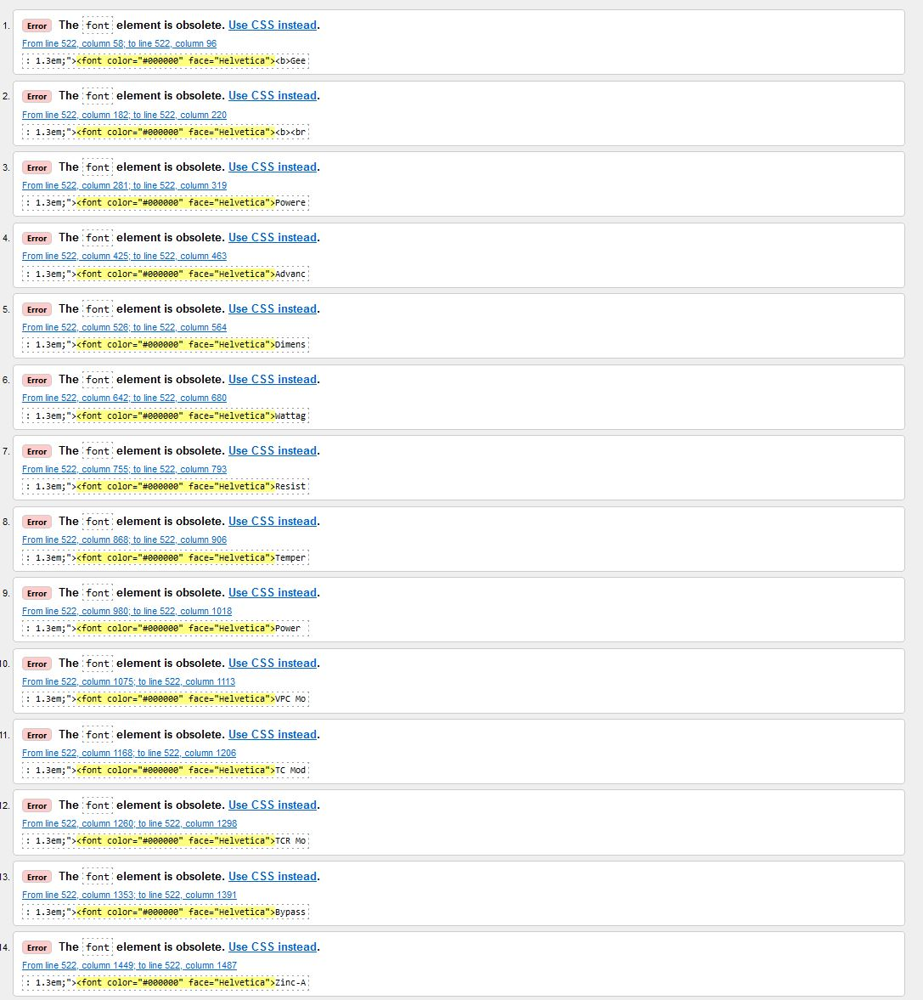

Once I filtered the errors away, the rest of the site had no errors.

#### **[CSS](https://jigsaw.w3.org/css-validator/)**

No errors were found within my CSS by checking each CSS file by direct input.

#### **[JavaScript](https://jshint.com/)**

Checking my static JS files with jshint, it picked up one undeclared variable, stripe-elements.js.

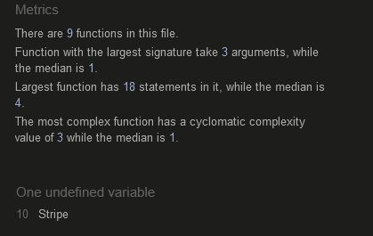

The above error was a false positive since this variable Stripe is the initialization of the stripe elements widget. Since this initializes a third-party API, I cannot change the variable name.

There was another set of warnings in mailChimp.js due to the use of the mail chimp API. I tried removing it entirely, but this caused other features to break on the site, so I put it back as it was. The warnings in jshint are not critical, so the file can be left as is.

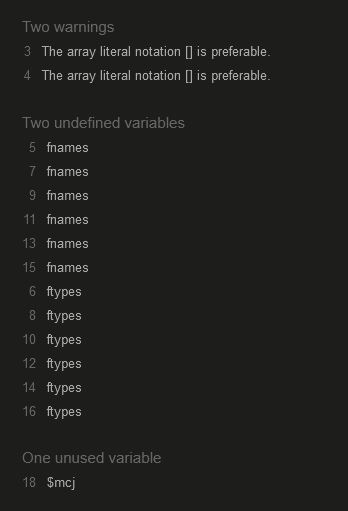

#### **Python - PEP8 - using pycodestyle**

Due to pep8online.com still not being online, I used pycodestyle to check my python code. pycodestyle is a command line installed with pip. I ran the command "pycodestyle --first <-appname->" which I adapted from the suggestion in the [documentation](https://pycodestyle.pycqa.org/en/latest/intro.html#features). This command checks all files in the directories and subdirectories of the app and returns the first error found. With this and cross-checking in the terminal of VScode, I found the only errors were some lines being too long(E501). Mostly these were in the migrations directory of each app. However, it is outside this project's scope to fix the migrations files autogenerated by the "python manage.py makemigrations" command.

Besides the lines in the migration files, there were four lines in my settings.py file with the same E501 error. They can be found under the constant declaration "AUTH_PASSWORD_VALIDATORS" on line 171. As mentioned in my last portfolio project, this is a long-standing issue with using the pep8 checker with Django, and there have been some [suggested resolutions](https://code.djangoproject.com/ticket/28163). However, Django seems to think shortening these lines is ill advisable. For this reason, I left them to be longer than 80 characters.

### **Wave Aim Accessibility checker**

To check the accessibility of my site, I used the [Wave](https://wave.webaim.org/) accessibility checker. This free tool checks for accessibility issues on a web page. It checks for contrast, alt text, and keyboard navigation issues. There were a few worthy documents listed below.

#### ***Within the Footer***

Consistently throughout the site, the footer was flagged for having one low contrast error and one error.  

These are related to the imported code from Mailchimp. The label-related error is for a hidden element; Mailchimp has included comments with this element advising mere mortals like me against messing with this code. The hidden part offers protection from bot sign-ups and is critical for security reasons. Since the component is hidden, I will play it safe and leave it as is.

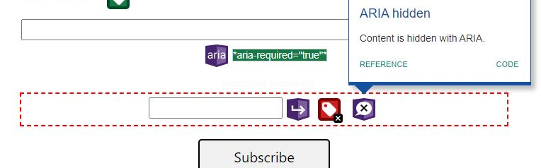

The contrast error comes from the "sr-only" span under the Facebook link. Sr-only is a class I have used to hide the text from the user but still have it read by screen readers, which is a common practice and recommended by the [W3C](https://www.w3.org/WAI/tutorials/forms/labels/#hiding-label-text), and so should be left as is. Further thinking about it could also be why Mailchimp has included the hidden label element to ensure that screen readers read the text. However, I am just speculating.

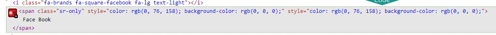

The above occurred again for the success toast shown on the checkout success page.

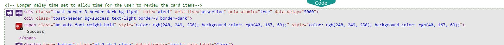

I also found that using white text on the toasts produced a low contrast score and so I changed the text to black. This change fixed the contrast error.

### **Lighthouse Scores**

#### **Home page**

##### **Desktop**

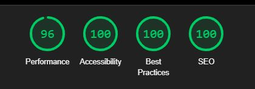
##### **Mobile**

#### **Products page**

##### **Desktop**

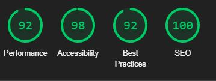
##### **Mobile**

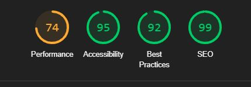

#### **Product Details Page**

##### **Desktop**

##### **Mobile**

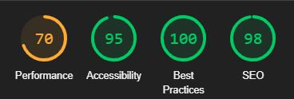

#### **Contact us page**

##### **Desktop**

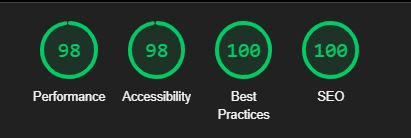
##### **Mobile**

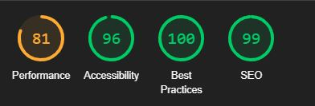

#### **Shopping Cart page**

##### **Desktop**

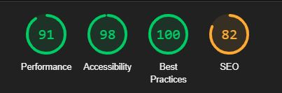
##### **Mobile**

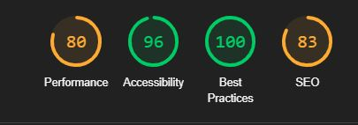

#### **Checkout page**

##### **Desktop**

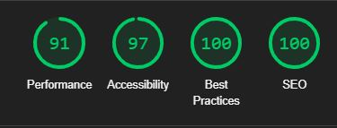
##### **Mobile**

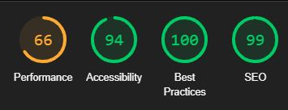

#### **Profile Page**

##### **Desktop**

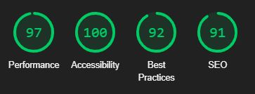
##### **Mobile**

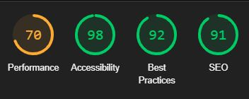

#### **Checkout Success/Order History Page**

##### **Desktop**

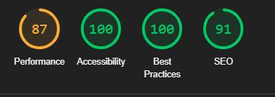
##### **Mobile**

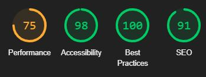

### **Reviewing the Lighthouse Scores**

The performance score was generally a little lower on mobiles however testing from several mobile devices the site was responsive and responded well.

I also note that any path disallowed in the robots.txt had its SEO score suffer with the robots.txt being specified as a cause.

### **Automated tests**

I began writing automated tests for everything; however, I soon realized this was slowing me down, and I needed to focus on completing the project. You will find automated test files in the home and product apps. However, the remaining apps do not have automated tests. I have decided to write manual tests for the remaining apps and features by testing each user story individually.

### **Manual Testing of User Stories**

For the following, I will skip the type of user, i.e. "As a shopper, I can…” and only list the latter part of the story as a heading.

#### **EPIC 1 - Set up and Deployment:**

Most of this epic were tasks for the development phase; therefore, the testing is the working of the overall site. Below is the one story that tested all tasks as one.

|passed | **Access a live url** so that I can **use the site on any device**.
|:---:|:---|
|&check;| Can access the site via the deployed URL on the desktop.
|&check;| Can access the site via the deployed URL on mobile.
|&check;| Can access the site via the deployed URL on a tablet.
|&check;| All images and styles are tacked and as expected.

#### **EPIC 2 - Viewing and Navigation:**

|passed | .**Clearly identity the sites purpose upon visiting** so that I can **determine if the site is what I am looking for.**
|:---:|:---|
|&check;| The site has a clear purpose and is easy to navigate.

|passed | **View a list of products** so that I can **select some to purchase.**
|:---:|:---|
|&check;| The site has a list of products.
|&check;| The list of products is paginated.
|&check;| The product list is ordered by default by ID.
|&check;| The list of products can be ordered by name ascending and descending.
|&check;| The list of products can be ordered by price ascending and descending.
|&check;| The list of products can be ordered by rating ascending and descending.
|&check;| The list of products can be filtered to show only those with an active sale.
|&check;| The list of products shows stock status, i.e., in stock/out of stock.
|&check;| Add to cart button works as expected on all products and product details pages.
|&check;| User cannot add more items to their cart that are in stock.
|&check;| When an item is out of stock, the add to cart button is disabled.

|passed | **View individual product details** so that I can **identify the price, description, detailed reviews, and product image enabling me to compare how the product differs from other items.**
|:---:|:---|
|&check;| The site has a product details page.
|&check;| The product details page shows the product image.
|&check;| The product details page shows the product name.
|&check;| The product details page shows the product price.
|&check;| The product details page shows the sale price if the item has a sale.
|&check;| The product details page shows the product description.
|&check;| The product details page shows the product rating.
|&check;| The product details page shows the product reviews.
|&check;| The product details page shows the review form if there are no reviews already.
|&check;| The product details page shows the stock status.
|&check;| The product details page shows the product quantity selector.
|&check;| The product details page shows the product add to cart button.
|&check;| User cannot add more items to the cart than are currently in stock.

|passed | **View the total of my purchases at any time** so that I can **see and review how much I am spending at any time whilst building an order.**
|:---:|:---|
|&check;| The site has a cart page.
|&check;| The cart page/preview shows the product image.
|&check;| The cart page/preview shows the product name.
|&check;| The cart page/preview shows the product price.
|&check;| The cart page/preview shows the current quantity in the cart.
|&check;| Cart preview shows when the item is added from any page.
|&check;| The cart page shows the product quantity selector, and the user can update their order quantity.
|&check;| The cart page/preview shows the cart total.
|&check;| The cart page/preview shows the amount left to spend to get free delivery.
|&check;| The cart page shows the delivery cost and grand total.
|&check;| The cart page allows the user to completely remove an item from their cart and updates the cart total.
|&check;| When the quantity is updated in the user's cart, the cart total updates accurately.

|passed | **Leave a review** so that I can **share my opinion of a product and leave a star rating.**
|:---:|:---|
|&check;| The site has a review form.
|&check;| The review form has a title field.
|&check;| The review form has a rating field.
|&check;| The review form has a body field.
|&check;| When there are no reviews, a review form is shown on the product detail page.
|&check;| When a review is submitted, the review is added to the product detail page.
|&check;| User cannot enter a value greater than 5 for the rating field.
|&check;| User cannot enter a value less than 1 for the rating field.
|&check;| User cannot submit a review without a title.
|&check;| User cannot submit a review without a rating.
|&check;| Overall rating is calculated and displayed on the product detail page/product card.
|&check;| Overall rating is adjusted when a review is deleted or edited.
|&check;| Author of the review can edit their review.
|&check;| Author of the review can delete their review.
|&check;| Author of the review can not edit or delete another user's review.
|&check;| success message is displayed when a review is submitted.

|passed | **View reviews of a product** so that I can **see what other people think of a product.**
|:---:|:---|
|&check;| The site has a review section on the product detail page.
|&check;| The review section shows the review title.
|&check;| The review heading indicates the review rating.
|&check;| The review heading previews the review body.
|&check;| The review heading shows the review author.
|&check;| The review heading indicates the review date.
|&check;| The review edit/delete buttons only show to the author and super users.
|&check;| Accordion opens and closes when clicked.
|&check;| Accordion only allows for one review to be expanded simultaneously to save display space.
|&check;| If there are no reviews, then an inline form is shown in place of the accordion.
|&check;| If reviews, there is a button above for the user to add a review.

|passed | **Identify any promotions that are available** so that I can **take advantage of them and obtain the best value for money possible.**
|:---:|:---|
|&check;| The site has a promotions page.
|&check;| The promotions page shows only active sales items.

|passed | **See clearly when something goes wrong on the site** so that I can **correct any errors and continue with my purchase.**
|:---:|:---|
|&check;| The site has a 404 page active when the URL is unknown.
|&check;| The site has a 500-page active when server error.
|&check;| Relevant feedback is displayed as a toast message when the user cannot act.

|passed | * ... **See a pleasantly styled and easy to navigate site** so that I can **enjoy the experience of using the site.**
|:---:|:---|
|&check;| The site has a pleasant colour scheme.
|&check; | The site has a pleasing font scheme.
|&check; | The site has a pleasing layout.
|&check; | The site has pleasant navigation.
|&check; | The site has a pleasant footer.
|&check; | The site has a nice header.
|&check; | The site has an enjoyable product card.
|&check; | The site has a pleasant product detail page.
|&check; | The site has a nice cart page.
|&check; | The site has a nice checkout page.
|&check; | The site has a pleasant promotions page.
|&check; | Everything is aligned and spaced correctly.

|passed | **Easily contact the store owner** so that I can **ask questions about the products or the site.**
|:---:|:---|
|&check;| The site has a contact page.
|&check;| Contact form cannot be submitted with required fields blank.
|&check;| Contact form cannot be presented with an invalid email address.
|&check;| Contact form submits a message to the database.
|&check;| Message can be read in the admin panel.
|&check;| Success message is shown to the user when a message is submitted.
|&check;| Notes can be added to the message in the admin panel.
|&check;| Message can be updated as done.
|&check;| pending reply is automatically ticked and can be un-ticked to indicate the message is complete
|&check;| Message can be deleted.
|&check;| Messages can be filtered by "marked as done" and "pending reply".
|&check;| Messages can be filtered by "all," "today," "this week," "this month," and "this year".

|passed | **All site users are of legal age to purchase vape supplies** so that I can **comply with the law.**
|:---:|:---|
|&check;| On the site's first visit, the user is asked to confirm they are over 18.
|&check;| If the user is under 18, they are blocked from viewing the site until they confirm they are of legal age.
|&check;| Cookie is left upon the user confirming they are of legal age.
|&check;| Pop-up appears on every page until the user confirms they are of legal age.
|&check;| Cookie has an expiry date of one day.

#### **EPIC 3 - Registration and User Accounts:**

|passed | **Register for an account** so that I can **save my personal details, view my order history online.**
|:---:|:---|
|&check;| The site has a registration page.
|&check;| Users can not register with an email address that is already in use.
|&check;| Users can successfully register for the site
|&check;| Users can not register with a username that is already in use.
|&check;| Users can not register with a password similar to their user name.
|&check;| Users can not register with a password similar to their email address.
|&check;| Users can not register with a too short password.
|&check;| Errors are displayed to the user if any of the above are attempted.
|&check;| Success message is displayed to the user if registration is successful.
|&check;| User sees message to verify their email.
|&check;| Users can not log in until they have verified their email.
|&check;| Verification email is sent to the user.
|&check;| Verification email contains a link to confirm the user's email.
|&check;| Once verified, users, can log in with their username or email.
|&check;| Users are redirected to the login in page once the email is verified.

|passed | **Easily login or logout at any time** so that I can **access my personal account information and protect it from unauthorized viewing on shared devices.**
|:---:|:---|
|&check;| Log in/out options are visible on all pages under the account dropdown.
|&check;| Once logged out, personal information is no longer visible.
|&check;| Once logged in, the account options change to reveal a profile link.
|&check;| Once logged in/out, the user is redirected to the home page.
|&check;| User receives a success message when they log in/out.

|passed | ...**Save my personal details to my profile from the checkout page** so that I **don’t have to enter them every time I make a purchase.**
|:---:|:---|
|&check;| The site has a profile page.
|&check;| The profile page has a form to update the user's details.
|&check;| Checkout form takes the information available in the profile for the checkout process
|&check;| Details from checkout save if save info box checked
|&check;| Details from checkout do not save if the save info box is not checked
|&check;| Shipping address on previous order unaffected by updating details.

|passed | **Amend my personal details from my profile** so that I can **update information should there be any changes.**
|:---:|:---|
|&check;| User can update their details on the profile page.
|&check;| Appropriate error messages are shown if the user enters invalid information.
|&check;| Success message is displayed if the user updates their details successfully.
|&check;| Shipping address on previous order unaffected by updating details.

|passed | **Recover my password in case I forget it** so that I can **regain access to my account in the event I lose my password.**
|:---:|:---|
|&check;| The site has a password reset page.
|&check;| The password reset page has a form to enter the user's email address.
|&check;| Email is sent with password reset token.
|&check;| Link in the email takes the user to the password reset page.
|&check;| Password reset page has a form to enter the new password.
|&check;| User gets a success message once the password has been reset
|&check;| Users can now log in with their new password.

|passed | **Receive an email confirmation upon registration** so that I can **confirm the registration process worked correctly.**
|:---:|:---|
|&check;| Email sent upon registration asking for the user to verify their email address.

#### **EPIC 4 - Sorting and Searching:**

|passed | **Sort the list of available products** so that I can **view them in different orders. and find the highest/lowest rating/prices and sort alphabetically to aid in finding the most suitable products to suit my needs.**
|:---:|:---|
|&check;| Products can be sorted by name in ascending order.
|&check;| Products can be sorted by name in descending order.
|&check;| Products can be sorted by price in ascending order.
|&check;| Products can be sorted by price in descending order.
|&check;| Products can be sorted by rating in ascending order.
|&check;| Products can be sorted by rating in descending order.

|passed | **Search for a product by name or content in the product description** so that I can **find a specific product I am looking for.**
|:---:|:---|
|&check;| Search bar is visible on all pages.
|&check;| Search returns results based on the search term.
|&check;| Search query matches product name and description.
|&check;| search terms are displayed above the search results.
|&check;| Number of products returned is displayed above the search results.

|passed | **View a list of products in a specific category** so that I can **view all products in that category.**
|:---:|:---|
|&check;| Products can be filtered by category via the navbar links.
|&check;| Products can be filtered by sub-category via the navbar links.

#### **EPIC 5 - Purchasing and Checkout:**

|passed | **Select a quantity of a product** so that I can **buy the required amount of the product.**
|:---:|:---|
|&check;| Quantity can be selected on the product page.
|&check;| Quantity can be selected on the product detail page.
|&check;| User cannot set the quantity selector to more than the in-stock level
|&check;| User cannot set the quantity selector to less than 1
|&check;| User can set the quantity selector to the in-stock level
|&check;| User can set the quantity selector to 1
|&check;| User can use the plus and minus buttons to select the quantity.
|&check;| User cannot add a quantity of 0 to the cart.
|&check;| User cannot add more than the stock level to their cart.
|&check;| server-side checks prevent the user from adding more than the stock level to their cart even if they change the input max value in the dev tools.
|&check;| User receives a message if an item is added to the cart.
|&check;| User receives a notification if the new quantity selected takes the cart's total number of items over the stock level.
|&check;| Quantity selector is disabled if the product is out of stock.

|passed | **View items in my bag to be purchased** so that I can **identify the total cost of my purchases before checkout.**
|:---:|:---|
|&check;| The site has a shopping cart page.
|&check;| The shopping cart page has a list of all the items in the user's cart.
|&check;| The shopping cart page has a total price for all the user cart items.
|&check;| The shopping cart page has a button to proceed to checkout.
|&check;| The shopping cart page has a button to remove items from the cart.

|passed | **Adjust the quantity of individual items in my bag** so that I can **easily make changes to my bag.**
|:---:|:---|
|&check;| The quantity of each item in the cart can be changed and updated from the cart page.
|&check;| Total recalculates each time the quantity is adjusted.
|&check;| User is shown a success/error message when the state changes in the cart.
|&check;| User cannot set the quantity selector to more than the in-stock level
|&check;| User cannot set the quantity selector to less than 1
|&check;| User can set the quantity selector to the in-stock level.
|&check;| User can set the quantity selector to 1.
|&check;| User can use the plus and minus buttons to select the quantity.
|&check;| User cannot add a quantity of 0 to the cart.

|passed | **Easily enter my payment information** so that I can **checkout quickly with no hassles by using information previously stored in the system.**
|:---:|:---|
|&check;| The site has a checkout page.
|&check;| The checkout page has a form to enter the user's payment details.
|&check;| The checkout page has a form to enter the user's shipping details.
|&check;| Payments are handled by Stripe.
|&check;| The checkout page has a button to complete the order.
|&check;| The checkout page has a button to cancel the order and return the user to the shopping cart.
|&check;| The checkout page has a button to save the user's details for future use.
|&check;| If checked, the details from the checkout form are saved to the user's profile.
|&check;| If it exists, the users saved details are pre-filled in the checkout form.
|&check;| If the user has saved details, the checkbox is unchecked by default.

|passed | **View an order confirmation after checkout** so that I can **verify that I haven’t made any mistakes.**
|:---:|:---|
|&check;| The site has a checkout success page.
|&check;| The checkout success page has a message to confirm the order was successful.
|&check;| The checkout success page has a button to return to the home page.|
|&check;| The checkout success page has a button to take the user to the special offers page.
|&check;| Email is sent to the user confirming the order.
|&check;| order is available to the customer who made the order in their order history page.
|&check;| checkout success page for an order made by a registered user can only be seen by that user from the profile.
|&check;| once an order is confirmed on screen, the order confirmation can only be revisited from a registered user's profile/non-registered users cannot revisit the checkout success page.

|passed | **Receive an email confirmation after checking out** so that I can **keep a record of my purchases.**
|:---:|:---|
|&check;| Email is sent to the user confirming the order.
|&check;| Email contains the order number.
|&check;| Email has the order total.
|&check;| Email includes the order date.
|&check;| Email contains the delivery address.
|&check;| Email includes the delivery cost.
|&check;| Email has a contact email address for assistance.

|passed | **View my order history** so that I can **see the orders I have made previously.**
|:---:|:---|
|&check;| The site has an order history page for registered users.
|&check;| The order history page lists all the orders made by the user.
|&check;| The order history page has a link to view the order details.
|&check;| The order history page has a link to return to their profile page.
|&check;| The order history page can only be accessed by the user who made the order.
|&check;| Unregistered users cannot access their previous order confirmation.
|&check;| Appropriate error message is shown if a user tries to access an order confirmation that is not theirs.
|&check;| Appropriate error message is displayed if an unregistered user tries to get back to their order confirmation using a URL.

|passed | **Access the checkout page** so that I can **review my order whilst entering my payment/shipping details**
|:---:|:---|
|&check;| The site has a checkout page.
|&check;| The checkout page has a form to enter the user's payment details.
|&check;| The checkout page has a form to enter the user shipping details.
|&check;| The checkout page has a button to complete the order.
|&check;| The checkout page has a button to cancel the order and return it to the shopping cart.
|&check;| The checkout page has a button to save the user's details for future use.
|&check;| If checked, the details from the checkout form are saved to the user's profile.
|&check;| If it exists, the users saved details are pre-filled in the checkout form.
|&check;| Saved points the checkbox is unchecked by default.
|&check;| Guest users are invited to register/sign in and warned that they could not view their order history online without registering.

|passed | **securely submit my payment details** so that I can **rest assured my financial information is safe**
|:---:|:---|
|&check;| Stripe payment system is used.
|&check;| Stripe payment system is PCI compliant.

#### **EPIC 6 - Admin and Store Management:**

|passed | **Add a product** so that I can **add new products to the store.**
|:---:|:---|
|&check;| Product can be added via the admin panel and is visible in the store front end.
|&check;| Newly added items had full functionality of pre-existing items.

|passed | **Edit a product** so that I can **update the details of a product.**
|:---:|:---|
|&check;| Product can be edited via the admin panel and is visible in the store front end.
|&check;| Quick edits can only be made from the front end by super users.

|passed | **Delete a product** so that I can **remove products that are no longer for sale.**
|:---:|:---|
|&check;| Product can be deleted via the admin panel and is no longer visible in the store front end.
|&check;| Quick delete can only be made from the front end by super users.
|&check;| product cannot be deleted by non-superuser using the URL.

|passed | **Add a promotion** so that I can **add new promotions to the store.**
|:---:|:---|
|&check;| Promotion can be added via the admin panel and is visible in the store front end.
|&check;| Start sale function in the admin panel set has sale to true.
|&check;| Remove sale function in the admin panel set has sale to false.
|&check;| 10% discount function reduces the discounted price to 10% less.
|&check;| 20% discount function reduces the discounted price to 20% less.
|&check;| 30% discount function reduces the discounted price to 30% less.
|&check;| 40% discount function reduces the discounted price to 40% less.
|&check;| 50% discount function reduces the discounted price to 50% less.
|&check;| Price comes from the discounted price when has sale is True.
|&check;| Price comes from RRP when has sale is false.
|&check;| Sale actions taken in the back end are visible on the front end via product cards and details pages.

|passed | **manually manage the stock levels** so that I can **input received purchase orders and ensure that the stock levels are accurate in case of discrepancies or damages.**
|:---:|:---|
|&check;| Stock levels can be manually adjusted via the admin panel.
|&check;| Stock levels can be manually adjusted via the front end.
|&check;| Stock levels are deducted upon successful purchase.
|&check;| Item set to out of stock if stock level is 0.
|&check;| If an order is deleted, the store is returned to the system.
|&check;| If an order is amended from the admin panel, the stock is also adjusted accordingly.
|&check;| Order cannot be amended to have more products than are in stock.

#### **EPIC 7 - Product Reviews:**

|passed | **Leave a review** so that I can **share my opinion of a product and leave a rating.**
|:---:|:---|
|&check;| The site has a review form.
|&check;| When there are no reviews for a product, the review form is displayed on the product details page.
|&check;| When there are reviews, they are displayed in an accordion with all relevant details visible.
|&check;| When there are reviews, the is a button to add a review.
|&check;| The leave review button takes the user to the review form page with the correct product name in the title and image displayed.
|&check;| The review form has a field to enter the review title, rating, and text.
|&check;| The review form has a button to submit the review.
|&check;| Rating cannot be above five or below one.
|&check;| Rating is a number field.
|&check;| Overall rating is re-calculated when a review is added.

|passed | **View reviews of a product** so that I can **see what other people think of a product.**
|:---:|:---|
|&check;| Once successfully submitted, the review is visible on the product details page.
|&check;| Author's name is in the accordion item heading.
|&check;| Review title is in the accordion item heading.
|&check;| Review text is previewed in the body of the accordion item.

|passed | **Edit my reviews of a product** so that I can **update my public opinion should it ever change*
|:---:|:---|  
|&check;| Review cannot be edited by a user who did not create the review (unless superuser) even by using the URL.  
|&check;| Edit review for is pre-populated with the review details.  
|&check;| A superuser can edit all reviews.  
|&check;| All reviews can be edited by the user who created the review.  
|&check;| Overall rating is re-calculated when a review is edited.  

|passed | **delete my reviews of a product** so that I can **remove previous reviews should I see fit**
|:---:|:---|
|&check;| Review cannot be deleted by a user who did not create the review (unless superuser) even by using the URL.
|&check;| A superuser can delete all reviews.
|&check;| All reviews can be deleted by the user who created the review.
|&check;| Overall rating is re-calculated when a review is deleted.

#### **EPIC 8 - Marketing:**

|passed | **Send promotional emails** so that I can **promote new products and offers to my customers.**
|:---:|:---|
|&check;| Mail chimp form visible from all pages.
|&check;| Mail chimp form has a field to enter the email address.
|&check;| Mail chimp form has a button to submit the email address.
|&check;| Collected email addresses are stored in the mail chimp database.

|passed | **Set up a social media page** so that I can **promote my business and products to the global market.**
|:---:|:---|
|&check;| Facebook page is set up.
|&check;| Facebook page is linked in the footer.
|&check;| Facebook page links have correct rel attributes.
|&check;| Facebook page has a shop now button linked to the sight.

|passed | .**Increase my search engine ranking** so that I can **increase the number of visitors to my site.**
|:---:|:---|
|&check;| Each page has a meta description.
|&check;| Each page has a meta title.
|&check;| Each page has meta keywords.
|&check;| Site map done
|&check;| Robots.txt done

[Back to Readme](README.md)
